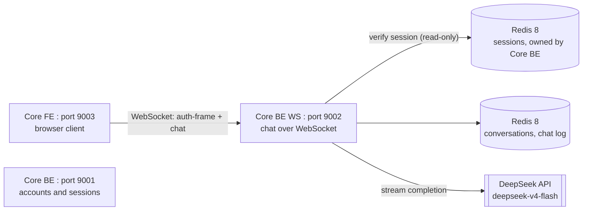
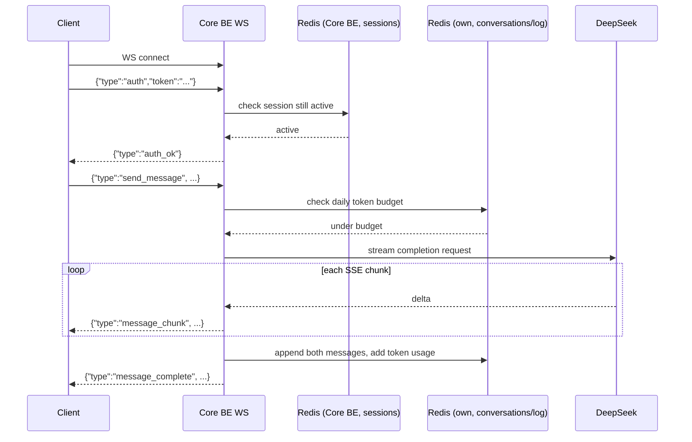

# High-Level Design: Core BE WS

 

## System context

Core BE WS is one of three services in the chat-bot product:

Core BE WS never issues tokens and never writes to Core BE's session store, it only reads from it to confirm a session is still active. It owns its own Redis instance for everything it does write: conversations, chat logs, and the daily token-budget counter used to bound DeepSeek spend.

 

## Responsibilities

- Accept a WebSocket connection, then require a first-message auth frame carrying a Core BE-issued JWT before accepting anything else.
- Let an authenticated connection create, list, rename, and delete named conversations.
- Send a user message to DeepSeek and stream the reply back chunk by chunk as it arrives.
- Persist both sides of every exchange to a per-conversation chat log, capped at the most recent 100 messages.
- Replay a conversation's stored history when the client reopens it, including after a full reconnect.
- Track and enforce a daily per-account token budget so DeepSeek spend stays bounded, since DeepSeek itself only limits concurrency, not spend.
- Report its own health and the exact commit running, for both local debugging and deployment verification.

 

## What it does not do

- It does not create accounts or issue JWTs, that is Core BE.
- It does not write to Core BE's session store, only reads it to check a session is still active.
- It does not serve any frontend assets, that is Core FE.
- It does not retry or fail over to another completion provider if DeepSeek is unavailable, a failed completion returns an error frame on the same connection.

 

## Connection flow: handshake through a streamed reply

A connection that fails the auth frame, sends something malformed, or sends an oversized message never reaches this flow: the first two close the connection outright, the last two return an `error` frame and stay open for the next message.

 

## Dependencies

- Redis 8 (own instance): conversation metadata, per-conversation chat log (capped at 100 messages), daily token-budget counter per account.
- Redis 8 (Core BE's instance, read-only): session records written by Core BE, checked on every auth frame.
- DeepSeek API (`deepseek-v4-flash`): streamed chat completions, called through an in-process semaphore capped at `maxConcurrentRequests`.
- Shared JWT secret with Core BE: Core BE issues, Core BE WS only verifies.
